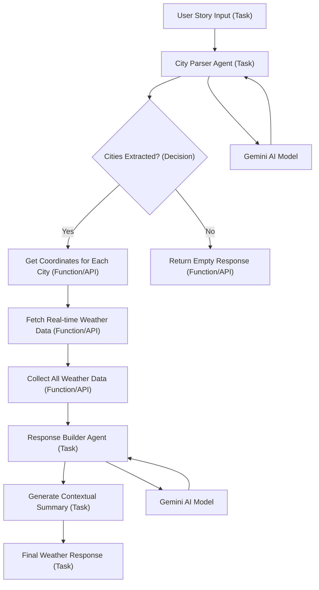

# Realtime Weather Agent

A fundamental AI agent that provides real-time weather information for multiple cities using natural language processing and agentic workflows.

## Overview

This project implements a basic agentic AI system that extracts city names from user queries and provides comprehensive weather information. The agent processes natural language input, identifies cities (even with typos), fetches real-time weather data, and generates contextual responses.

## Architecture

```
User Input (Natural Language)
        ↓
   City Parser (AI Agent)
        ↓
  Coordinate Fetching
        ↓
  Weather Data Retrieval(API Calls)
        ↓
  Response Builder (AI Agent)
        ↓
    Final Response
```

### Flow Diagram



## Core Components

### 1. City Parser (`src/utils/cityParser.js`)
- Uses AI to extract city names from messy user input
- Handles typos, multiple cities, and mixed languages
- Returns structured JSON array of valid city names

### 2. Coordinate Fetching (`src/utils/getCoordinates.js`)
- Converts city names to latitude/longitude coordinates
- Uses API Ninjas Geocoding API for accurate location data

### 3. Weather Data Retrieval (`src/utils/getWeather.js`)
- Fetches real-time weather data using Open-Meteo API
- Retrieves current temperature, daily min/max, precipitation probability
- Includes sunrise/sunset times with proper timezone handling

### 4. Response Builder (`src/utils/responseBuilder.js`)
- AI-powered response generation
- Creates conversational summaries comparing multiple cities
- Provides recommendations and activity suggestions

### 5. AI Query Interface (`src/utils/queryAI.js`)
- Unified interface for Google Gemini AI interactions
- Handles all LLM communications for the agent

## Why We Chose Basic Agentic AI Over RAGs

This project deliberately avoids using Retrieval Augmented Generation (RAGs) to focus on **fundamental agentic AI principles**:

### Learning Objectives
1. **Core Agent Workflows**: Understanding how AI agents make decisions and coordinate multiple tasks
2. **Real-time Data Integration**: Learning to combine AI reasoning with live APIs
3. **Agent Orchestration**: Building systems where multiple AI calls work together sequentially
4. **Error Handling in Agent Systems**: Managing failures across multiple AI and API interactions

### Why Not RAGs?
- **Simplicity Focus**: RAGs add complexity that would obscure the core agentic patterns we're learning

### Agentic AI Fundamentals Demonstrated
- **Task Decomposition**: Breaking complex queries into manageable steps
- **Agent Coordination**: Multiple AI agents working together (city parsing → weather retrieval → response building)
- **Error Propagation**: Graceful handling of failures at each agent stage
- **Context Preservation**: Maintaining state across multiple API calls and AI interactions

## Setup

1. Install dependencies:
```bash
npm install
```

2. Create `.env` file with required API keys:
```env
GEMINI_API_KEY=your_gemini_api_key
NINJA_API_KEY=your_ninja_api_key
```

3. Run the agent:
```bash
node src/index.js
```

## Dependencies

- **@google/genai**: Google Gemini AI for natural language processing
- **openmeteo**: Real-time weather data API client
- **dotenv**: Environment variable management
- **lodash**: Utility functions for data manipulation

## Example Usage

```javascript
const story = "what is the weather like in Delhi, Singapore and Ghaziabad?"
main(story)
```

The agent will:
1. Extract cities: ["Delhi", "Singapore", "Ghaziabad"]
2. Fetch real-time weather for each location
3. Generate a comparative summary with recommendations

## Learning Outcomes

This project demonstrates:
- **Agent Design Patterns**: How to structure AI agents for complex workflows
- **Error Resilience**: Building robust systems that handle API failures gracefully
- **Real-time Integration**: Combining AI reasoning with live data sources
- **Natural Language Processing**: Using AI for both input parsing and output generation
- **Microservice Architecture**: Modular design with clear separation of concerns

Perfect for understanding the fundamentals of agentic AI systems before moving to more complex patterns like RAGs or multi-agent orchestration frameworks.
