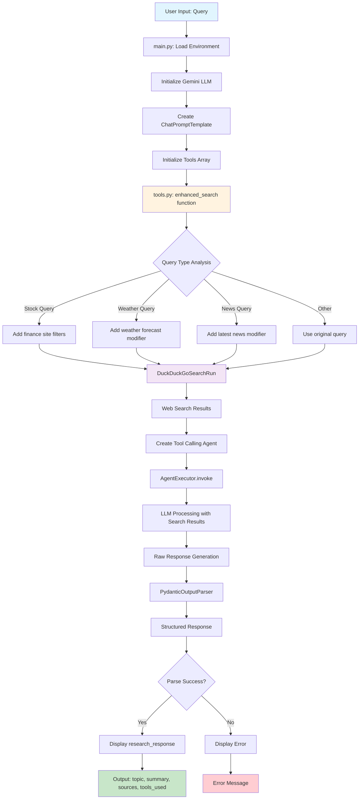

# Research Assistant Project Flow

Based on my analysis of the project, here's a mermaid flow diagram of the research assistant:

## Project Flow Summary:

1. **Entry Point** (`main.py:55`): User provides a research query
2. **Environment Setup** (`main.py:12-17`): Loads environment variables and initializes Gemini LLM
3. **Prompt Configuration** (`main.py:29-45`): Sets up ChatPromptTemplate with system instructions
4. **Tool Processing** (`tools.py:7-21`): Enhanced search function analyzes query type and adds appropriate modifiers
5. **Web Search** (`tools.py:8,21`): DuckDuckGoSearchRun executes the enhanced query
6. **Agent Execution** (`main.py:48-52`): Tool calling agent processes the query with search results
7. **Response Processing** (`main.py:61`): PydanticOutputParser structures the response
8. **Output** (`main.py:62`): Displays structured response with topic, summary, sources, and tools used

The project uses LangChain framework with Gemini LLM to create an intelligent research assistant that enhances user queries and provides structured responses based on real-time web search results.